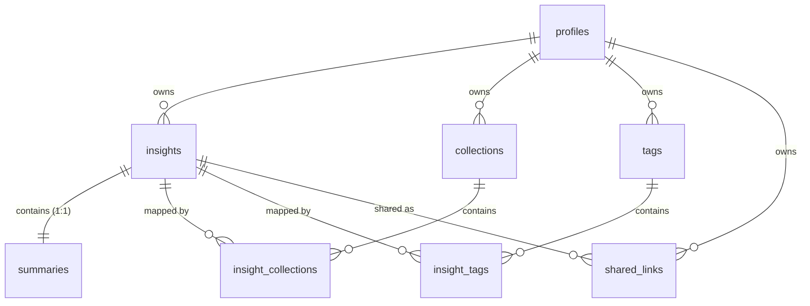

# 🗄️ Database Schema & Architecture

This document describes the canonical database schema for the application when deploying to **Supabase**. The schema is designed for safety, performance, and cascading structure, with complete support for offline queue synchronization (Local-First philosophy).

---

## 🏛️ The Tables

Our database comprises eight specialized tables in the `public` schema. All transactional tables utilize **Row-Level Security (RLS)** to keep user records entirely isolated.

### 1. `profiles`
Holds standard user credentials, display characteristics, and billing privileges (Standard vs. Executive/Pro tier).
- **Triggers:** Automatically generated when a user signs up via Supabase/GoTrue Auth (`auth.users`).
- **Columns:**
  - `id` (uuid, PK): Primary key map targeting `auth.users(id)` with cascading deletion.
  - `full_name` (text): Display name of the user.
  - `avatar_url` (text): Public avatar identifier.
  - `is_pro` (boolean): Flag active for Pro features (e.g., Google Workspace bridges, advanced models, deep summaries). Defaults to `false`.
  - `updated_at` (timestamptz): Real-time synchronization timestamp.

### 2. `insights`
The central registry containing notes, Web URLs, and metadata parameters.
- **Columns:**
  - `id` (uuid, PK): Unique identification key (generated on-client or server-side).
  - `user_id` (uuid, FK): Reference pointing to `public.profiles(id)` indicating ownership.
  - `title` (text): Descriptive or auto-generated title.
  - `raw_content` (text): Underlying unrefined source data or original input text.
  - `source_url` (text): Holds URLs for web-scrapped entries or static audio player streams.
  - `source_type` (text): Structured record class. Expected values: `MEETING`, `URL`, `TEXT`, `VIDEO`.
  - `is_favorite` (boolean): Quick-access pin indicator.
  - `is_archived` (boolean): Archive folder flag.
  - `deleted_at` (timestamptz): Populated for soft-deletion recovery (Trash Bin).
  - `favicon_url` (text): Direct icon graphic of the web resource.
  - `site_name` (text): Name of the web host or system identifier.
  - `processed_text` (text): Clean text content or complete transcripts.
  - `processing_status` (text): Node operational state. Expected values: `local`, `syncing`, `pending`, `processing`, `completed`, `failed`.
  - `storage_path` (text): Pointer referencing the corresponding backup file inside the `meetings` storage bucket.
  - `error_message` (text): Populated with errors if intelligence analysis fails.
  - `metadata` (jsonb): JSON configuration object containing token counts, metrics, options, and model details.
  - `duration_seconds` (integer): Length of the voice-recorded note.
  - `created_at`, `updated_at` (timestamptz): Automatic temporal records.

### 3. `summaries`
Maintains the high-quality intelligence recaps generated by the AI reasoning engine. This matches a logical `1:1` relationship with `insights`.
- **Columns:**
  - `insight_id` (uuid, PK, FK): Points to parent `insights(id)` with cascading deletion on removal.
  - `user_id` (uuid, FK): Reference to `profiles(id)` for security policy validations.
  - `summary` (text): Markdown-powered executive recap summary.
  - `highlights` (text[]): Flat array of key takeaways.
  - `topics` (text[]): Curated list of intelligence categories.
  - `entities` (text[]): Discovered people, dates, figures, or products.
  - `action_items` (text[]): Extracted list of checklist instructions.
  - `sentiment` (text): Tone representation (`POSITIVE`, `NEUTRAL`, `NEGATIVE`, `COMPLEX`).
  - `reading_time` (integer): Est. reading duration in minutes.
  - `is_deep_strategist` (boolean): Flag indicating Pro-level comprehensive analyst outputs.
  - `created_at`, `updated_at` (timestamptz): Temporal records.

### 4. `collections`
Virtual folders created by the user to organize related insight rows.
- **Columns:**
  - `id` (uuid, PK): Unique collection key.
  - `user_id` (uuid, FK): Points to owner `profiles(id)`.
  - `name` (text): Descriptive classification name.
  - `created_at`, `updated_at` (timestamptz): Management timestamps.

### 5. `tags`
Categorical descriptors to quickly filter notes. Supports auto-tagging.
- **Columns:**
  - `id` (uuid, PK): Unique identifier.
  - `user_id` (uuid, FK): Points to owner `profiles(id)`.
  - `name` (text): Trimmed lowercase name identifier. Contains a unique constraint on `(user_id, name)` to guarantee cleanliness.
  - `created_at`, `updated_at` (timestamptz): Management timestamps.

### 6. `insight_collections` & `insight_tags`
High-performance relational mapping tables linking notes to their folders/labels.
- **Characteristics:** Composite PKs with complete ON DELETE CASCADE on both primary entities.

### 7. `shared_links`
Secure guest-accessible share flyers. Holds static snapshot parameters of notes so parents can change independently without breaking public linkages.
- **Columns:**
  - `slug` (text, PK): High-entropy lookup slug.
  - `insight_id` (uuid, FK): Underlying note reference.
  - `user_id` (uuid, FK): Reference to owner profile.
  - `title`, `summary` (text): Captured snapshot parameters.
  - `highlights`, `action_items` (text[]): Takeaway array snapshot.
  - `processed_text` (text): Snapshot copy of raw transcript.
  - `audio_url` (text): Expiry-bounded signed audio path.
  - `sentiment`, `site_name` (text): Characteristics copy.
  - `is_collaborative` (boolean): Toggle allowing viewer action modifications.
  - `completed_indices` (integer[]): List of completed action item tracker indices.
  - `expires_at` (timestamptz): Dynamic link expiry limit.
  - `version` (integer): Revision parameter.
  - `created_at` (timestamptz): Publication time.

---

## 🔒 Row-Level Security (RLS) & Policies

1. **User Segregation:** Standard tables have RLS enabled. Users can only read or modify assets where `auth.uid() = user_id`.
2. **Public Sharing Access:** The `shared_links` table is configured with a public access SELECT policy allowing guests to read shared snapshots without prompting login, while keeping mutate commands locked directly to the owner.
3. **Storage Bucket Permission:** A storage bucket named `meetings` must be created. Read and write actions to this bucket are restricted to the owner's relative folder (`{auth.uid()}/*`).

---

## 🚀 Optimization Indexes

Built-in indices on all referencing foreign keys guarantee lightning-quick response times inside the responsive dashboard feeds under heavy paging or complex multi-filtering requests:
- `idx_insights_user` on `insights(user_id)`
- `idx_summaries_insight` on `summaries(insight_id)`
- `idx_collections_user` on `collections(user_id)`
- `idx_tags_user` on `tags(user_id)`
- `idx_shared_links_slug` on `shared_links(slug)`
